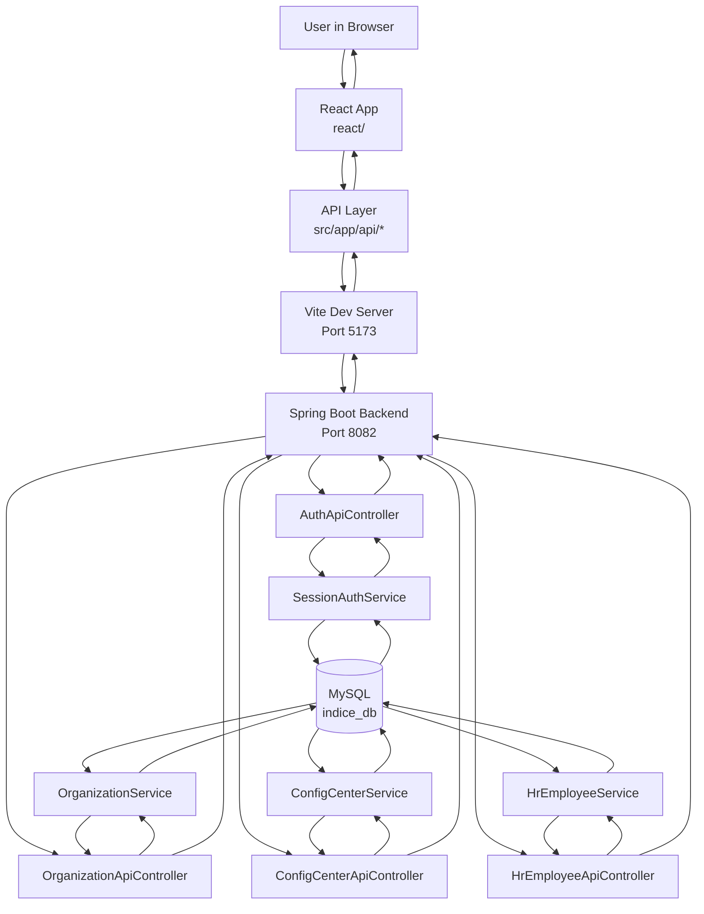
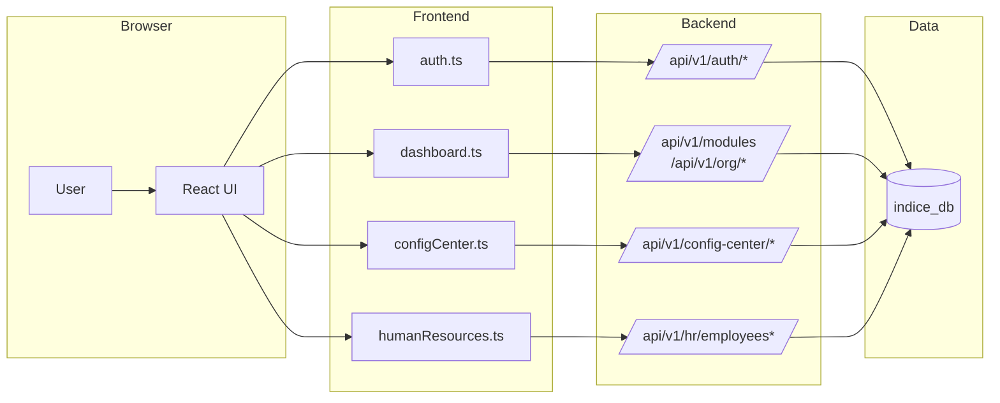
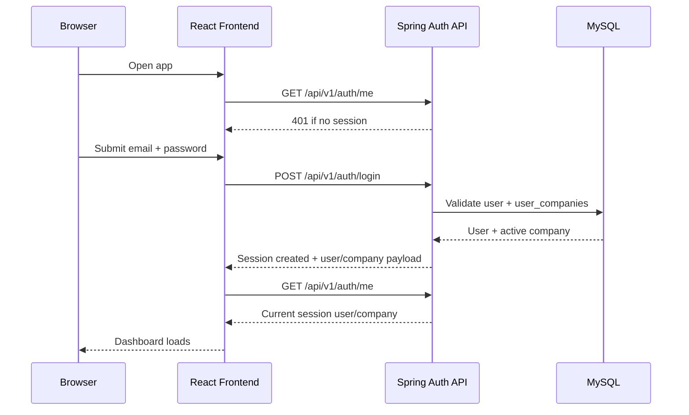
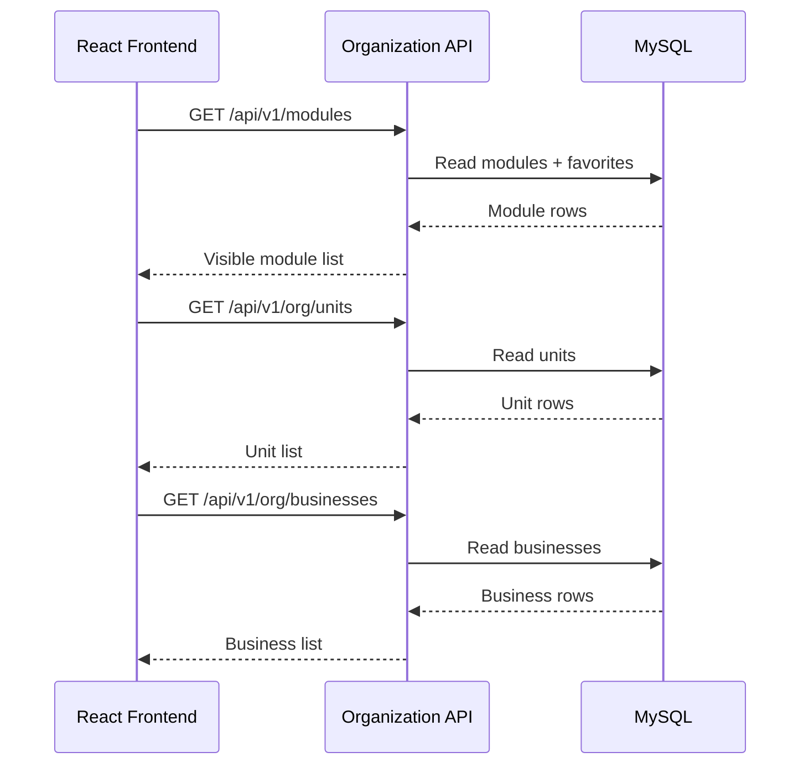
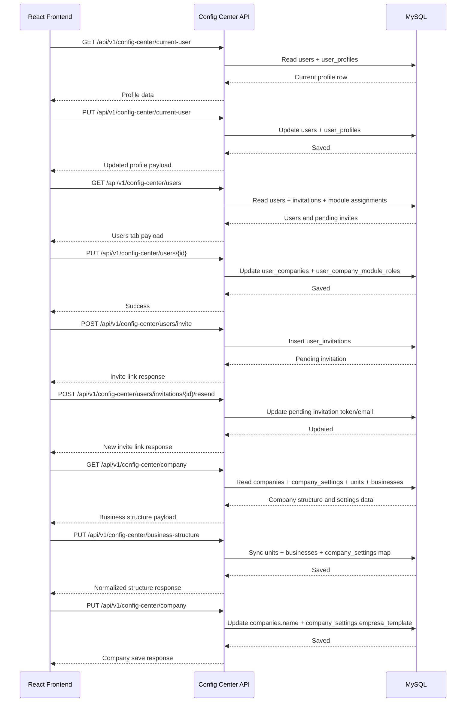
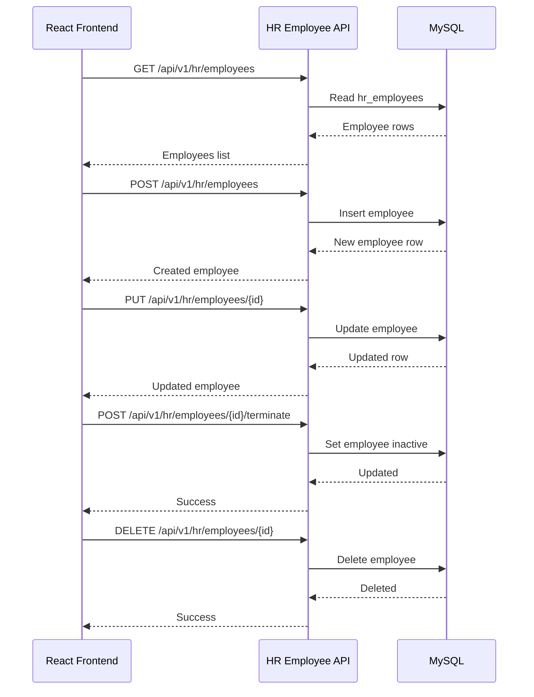

# Workflow Diagram

This document shows the current **new architecture workflow** for the React frontend and Spring backend.

It reflects the current standalone contract:

- React frontend under `react/`
- Spring backend under `src/main/java/com/indice/erp`
- REST API under `/api/v1/...`
- shared MySQL database `indice_db`

## High-Level Workflow

## Request Flow By Feature

## Login And Session Workflow

## Dashboard Workflow

## Config Center Workflow

## Human Resources Workflow

## Current Data Ownership

- React owns:
  - rendering
  - client-side navigation
  - UI state

- Spring owns:
  - authentication
  - session handling
  - business logic
  - data access

- MySQL owns:
  - persistent storage
  - current legacy/shared schema reused by Spring

## Current Limitation

The backend is standalone, and Spring now owns Flyway migrations for the subset of the schema it actively uses.

However, the overall database is still the existing shared schema from the PHP era.

So the architecture is:

- **standalone frontend**
- **standalone Spring backend**
- **shared existing MySQL schema with partial Spring-owned migration coverage**

not yet:

- full Spring ownership of the entire legacy schema
